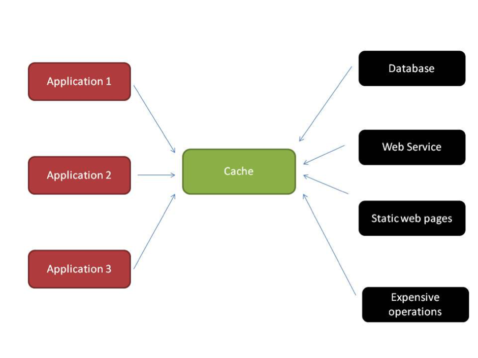

# java 本地缓存技术

## 1 缓存技术

> 一般来说，缓存是将应用程序中的对象存储在称为缓存的临时存储区域中的一种技术。缓存本身可以被认为是内存中的数据结构。缓存对象可以是任何昂贵且耗时的操作，静态网页或后端数据库的内容。缓存将应用程序从需要获取相同信息（从任何数据源）或通过重复执行相同的昂贵计算的需求，通过在需要时存储到中间缓存并从中间缓存中获取来进行隔离。

> 缓存提供了几个好处，这就是为什么在需要快速访问数据的用例中，它被大量使用。适当的缓存可以提高性能，减少资源使用并提高响应速度。

> 通常，在企业应用程序中，高速缓存充当中间低延迟数据源，位于应用程序和后端系统之间。

## 2 应用场景
## 3 JSR107标准--javax.cache
## 4 常用缓存技术

参考:
* [Java Caching](https://dzone.com/refcardz/java-caching)
* [JCache in Java EE 8](https://abhirockzz.wordpress.com/2016/01/21/jcache-in-java-ee-8/)
