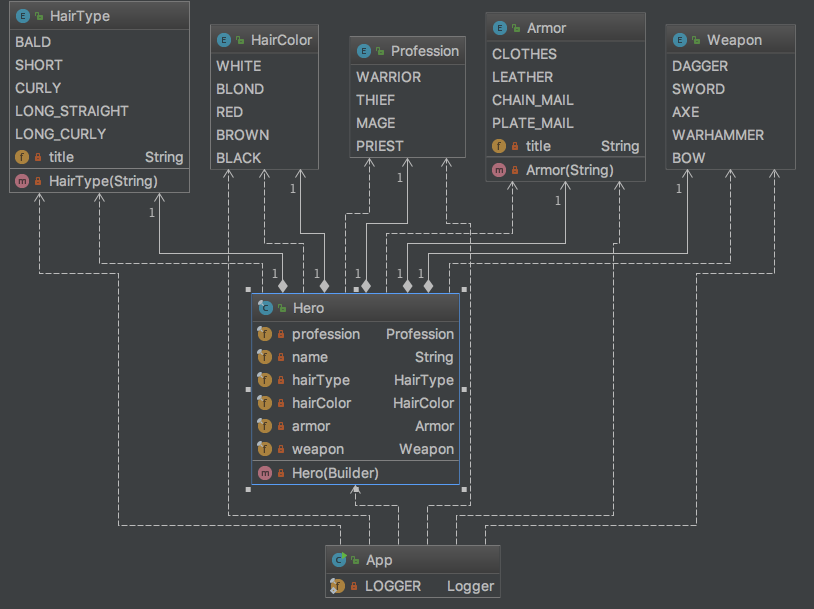

# 建造者模式(Builder pattern)

## 1 定义
> 将一个复杂对象的构建与它的表示分离，使得同样的构建过程可以创建不用的表示。

> Separate the construction of a complex object from its representation so that the same construction process can create different representation.

## 2 角色

* Product 产品类
* Builder 抽象建造者
* ConcreteBuilder 具体建造者
* Client 客户端

## 3 类图

## 4 优点
* 封装性
* 建造者独立，容易扩展
* 便于控制细节风险

## 5 缺点

## 6 注意
> 建造者模式关注的是零件类型和装配工艺（顺序），这是它与工厂方模式最大的不同。

## 7 应用
* 相同的方法，不同的执行顺序，产生不用的事件结果时；
* 多个部件或零件，都可以装配到一个对象中，但是产生的运行结果又不相同时；
* 产品类非常复杂，或者产品类中的调用顺序不同产生类不同的效能；
* 在对象创建过程中会使用到系统中的一些其它对象，这些对象在产品的创建过程中不易得到时

