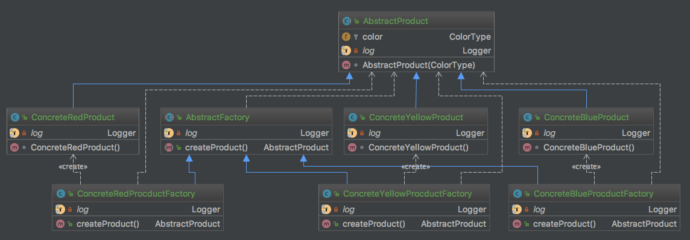

# 工厂方法模式

> 工厂模式（Factory Pattern）是 Java 中最常用的设计模式之一。
这种类型的设计模式属于创建型模式，它提供了一种创建对象的最佳方式。

## 1 介绍

### 1.1 模式动机

> 定义一个创建对象的接口，让其子类自己决定实例化哪一个工厂类，工厂模式使其创建过程延迟到子类进行。

### 1.2 模式定义

> 工厂方法模式(Factory Method Pattern)又称为工厂模式，
也叫虚拟构造器(Virtual Constructor)模式或者多态工厂(Polymorphic Factory)模式，
它属于类创建型模式。在工厂方法模式中，工厂父类负责定义创建产品对象的公共接口，
而工厂子类则负责生成具体的产品对象，这样做的目的是将产品类的实例化操作延迟到工厂子类中完成，
即通过工厂子类来确定究竟应该实例化哪一个具体产品类。

### 1.3 适用环境

> * 1、日志记录器：记录可能记录到本地硬盘、系统事件、远程服务器等，用户可以选择记录日志到什么地方。 
> * 2、数据库访问，当用户不知道最后系统采用哪一类数据库，以及数据库可能有变化时。 
> * 3、设计一个连接服务器的框架，需要三个协议，"POP3"、"IMAP"、"HTTP"，
可以把这三个作为产品类，共同实现一个接口。

### 1.4 模式应用

> * 1、您需要一辆汽车，可以直接从工厂里面提货，而不用去管这辆汽车是怎么做出来的，以及这个汽车里面的具体实现。 
> * 2、Hibernate 换数据库只需换方言和驱动就可以。

### 1.5 优点

> * 1、一个调用者想创建一个对象，只要知道其名称就可以了。 
> * 2、扩展性高，如果想增加一个产品，只要扩展一个工厂类就可以。 
> * 3、屏蔽产品的具体实现，调用者只关心产品的接口。

### 1.6 缺点

> * 1 每次增加一个产品时，都需要增加一个具体类和对象实现工厂，使得系统中类的个数成倍增加，
在一定程度上增加了系统的复杂度，同时也增加了系统具体类的依赖。

### 1.7 模式结构

> 工厂方法模式包含如下角色：

> * AbstractProduct：抽象产品
> * ConcreteProduct：具体产品
> * AbstractFactory：抽象工厂
> * ConcreteFactory：具体工厂

> 类图：

### 1.8 时序图

## 2 代码分析

> 抽象工厂类 AbstractFactory：
    
    public abstract class AbstractFactory {
        public abstract AbstractProduct createProduct();
    }

> 具体工厂类 AbstractProduct：

    public abstract class AbstractProduct {
    
        protected ColorType color;
    
        AbstractProduct(ColorType color){
            this.color = color;
        }
    
        public enum ColorType{
    
            RED,
            BLACK,
            BLUE,
            YELLOW;
        }
    }
> 具体产品类 ConcreteBlueProduct：

    public class ConcreteBlueProduct extends AbstractProduct {
    
        ConcreteBlueProduct() {
            
            super(ColorType.RED);
        }
    }

> 具体产品类 ConcreteBlueProcductFactory：

    @Slf4j
    public class ConcreteBlueProcductFactory extends AbstractFactory{
    
        @Override
        public  AbstractProduct createProduct() {
            log.info("-*--*--*--*- 创建蓝色产品-*--*--*--*--");
            return new ConcreteBlueProduct();
        }
    }

> 客户端 Client：

    @Slf4j
    public class Client {
    
        public static void main(String[] args) {
    
            AbstractProduct blueProduct = new ConcreteBlueProcductFactory().createProduct();
    
            AbstractProduct redProduct = new  ConcreteRedProcductFactory().createProduct();
    
            AbstractProduct yellowProduct = new ConcreteYellowProcductFactory().createProduct();
    
        }
    }

## 3 模式分析

> 作为一种创建类模式，在任何需要生成复杂对象的地方，都可以使用工厂方法模式。
有一点需要注意的地方就是复杂对象适合使用工厂模式，而简单对象，
特别是只需要通过 new 就可以完成创建的对象，无需使用工厂模式。
如果使用工厂模式，就需要引入一个工厂类，会增加系统的复杂度。

## 4 实例

## 模式扩展

> * 使用多个工厂方法：在抽象工厂角色中可以定义多个工厂方法，
从而使具体工厂角色实现这些不同的工厂方法，这些方法可以包含不同的业务逻辑，
以满足对不同的产品对象的需求。
> * 产品对象的重复使用：工厂对象将已经创建过的产品保存到一个集合（如数组、List等）中，
然后根据客户对产品的请求，对集合进行查询。如果有满足要求的产品对象，就直接将该产品返回客户端；
如果集合中没有这样的产品对象，那么就创建一个新的满足要求的产品对象，然后将这个对象在增加到集合中，
再返回给客户端。
> * 多态性的丧失和模式的退化：如果工厂仅仅返回一个具体产品对象，便违背了工厂方法的用意，发生退化，
此时就不再是工厂方法模式了。一般来说，工厂对象应当有一个抽象的父类型，
如果工厂等级结构中只有一个具体工厂类的话，抽象工厂就可以省略，也将发生了退化。
当只有一个具体工厂，在具体工厂中可以创建所有的产品对象，并且工厂方法设计为静态方法时，
工厂方法模式就退化成简单工厂模式。

## 总结

> * 工厂方法模式又称为工厂模式，它属于类创建型模式。在工厂方法模式中，
工厂父类负责定义创建产品对象的公共接口，而工厂子类则负责生成具体的产品对象，
这样做的目的是将产品类的实例化操作延迟到工厂子类中完成，
即通过工厂子类来确定究竟应该实例化哪一个具体产品类。
> * 工厂方法模式包含四个角色：抽象产品是定义产品的接口，是工厂方法模式所创建对象的超类型，
即产品对象的共同父类或接口；具体产品实现了抽象产品接口，某种类型的具体产品由专门的具体工厂创建，
它们之间往往一一对应；抽象工厂中声明了工厂方法，用于返回一个产品，它是工厂方法模式的核心，
任何在模式中创建对象的工厂类都必须实现该接口；具体工厂是抽象工厂类的子类，
实现了抽象工厂中定义的工厂方法，并可由客户调用，返回一个具体产品类的实例。
> * 工厂方法模式是简单工厂模式的进一步抽象和推广。由于使用了面向对象的多态性，
工厂方法模式保持了简单工厂模式的优点，而且克服了它的缺点。在工厂方法模式中，
核心的工厂类不再负责所有产品的创建，而是将具体创建工作交给子类去做。
这个核心类仅仅负责给出具体工厂必须实现的接口，而不负责产品类被实例化这种细节，
这使得工厂方法模式可以允许系统在不修改工厂角色的情况下引进新产品。
> * 工厂方法模式的主要优点是增加新的产品类时无须修改现有系统，并封装了产品对象的创建细节，
系统具有良好的灵活性和可扩展性；其缺点在于增加新产品的同时需要增加新的工厂，
导致系统类的个数成对增加，在一定程度上增加了系统的复杂性。
> * 工厂方法模式适用情况包括：一个类不知道它所需要的对象的类；一个类通过其子类来指定创建哪个对象；
将创建对象的任务委托给多个工厂子类中的某一个，客户端在使用时可以无须关心是哪一个工厂子类创建产品子类，
需要时再动态指定。
