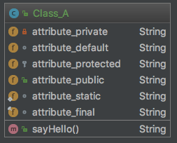
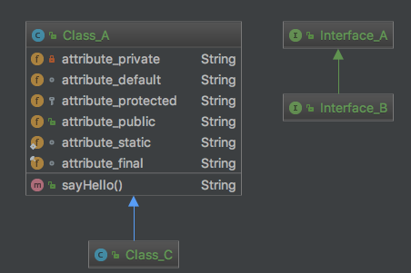
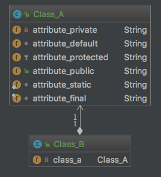
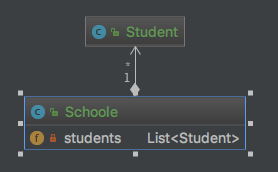
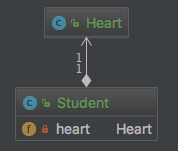

# UML 基础

## 1 类图

> UML用类图表示类、接口及其关联。类图用于静态对象建模。
示例(Intellij idea中)：

## 2 类的关系

* ### 2.1 继承
> 继承关系也称泛化关系，指的是一个类（称为子类、子接口）继承另外的一个类（称为父类、父接口）的功能，并可以增加它自己的新功能的能力，继承是类与类或者接口与接口之间最常见的关系；在Java中此类关系通过关键字extends明确标识。

>在UML当中，对泛化关系有三个要求：
> * 子类与父类应该完全一致，父类所具有的属性、操作，子类应该都有；
> * 子类中除了与父类一致的信息以外，还包括额外的信息；
> * 可以使用父类的实例的地方，也可以使用子类的实例；

* #### 2.2 实现
> 指的是一个class类实现interface接口（可以是多个）的功能；实现是类与接口之间最常见的关系；在Java中此类关系通过关键字implements明确标识

* #### 2.3 依赖
>依赖关系(Dependency) 是一种使用关系，特定事物的改变有可能会影响到使用该事物的其他事物，在需要表示一个事物使用另一个事物时使用依赖关系。大多数情况下，依 赖关系体现在某个类的方法使用另一个类的对象作为参数。

>依赖关系有如下三种情况：
> * A类是B类中的（某中方法的）局部变量；
> * A类是B类方法当中的一个参数；
> * A类对B类的静态方法调用；
> * A类向B类发送消息，从而影响B类发生变化；

* #### 2.4 关联
> 关系是类与类之间的联接，它使一个类知道另一个类的属性和方法。关联可以是双向的，也可以是单向的。

> 给定有关联的两个类，可以从一个类的对象得到另一个类的对象。关联有两元关系和多元关系。两元关系是指一种一对一的关系，多元关系是一对多或多对一的关系。两个类之间的简单关联表示了两个同等地位类之间的结构关系。当你想要表示结构化关系时使用关联。

> __在Java语言中，关联关系一般使用成员变量来实现。__

 
* #### 2.5 聚合
> 聚合关系是关联关系的一种，是强的关联关系。
聚合是整体和个体之间的关系。例如，School类与Student类的关系便整体和个体的关系。
与关联关系一样，聚合关系也是通过实例变量实现的。
但是关联关系所涉及的两个类是处在同一层次上的，而在聚合关系中，两个类是处在不平等层次上的，
一个代表整体，另一个代表部分。

* #### 2.6 组合
>组合关系也表示类之间整体和部分的关系，但是组合关系中部分和整体具有统一的生存期。
一旦整体对象不存在，部分对象也将不存在，部分对象与整体对象之间具有 __同生共死__ 的关系。
 

## 3 时序图

> 时序图显示具体用例（或者是用例的一部分）的详细流程。
它几乎是自描述的，并且显示了流程中中不同对象之间的调用关系，同时还可以很详细地显示对不同对象的不同调用。

参考: 
* [UML类图关系（泛化 、继承、实现、依赖、关联、聚合、组合）](http://www.cnblogs.com/olvo/archive/2012/05/03/2481014.html)