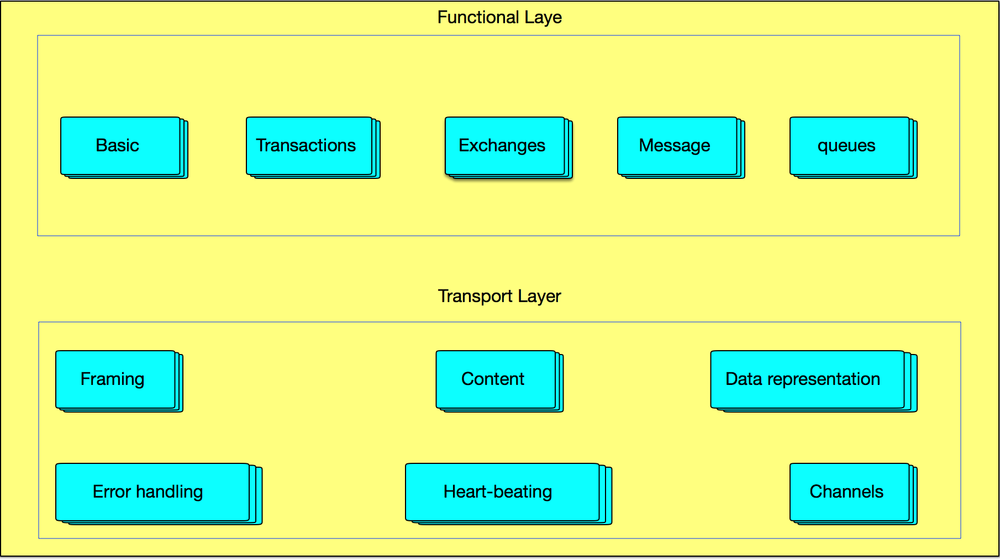

# AMQP 0-9-1 学习

## 1 简介
> 高级消息队列协议（AMQP）是面向消息中间件的开放标准应用层协议。 AMQP的定义特征是消息定向，排队，路由（包括点对点和发布和订阅），可靠性和安全性。
### 1.1 场景
### 1.2 历史

## 2 架构
### 2.1 架构图
> AMQP协议是一个具有现代功能的二进制协议：它是多通道，协商，异步，安全，便携，中立和高效的。 AMQP根据用途分为两层：

### 2.2 模型简介
### 2.3 角色分工
## 3 协议实现
### 3.1 实现
### 3.2 对比

参考:
* [AMQP 0-9-1](http://www.amqp.org/specification/0-9-1/amqp-org-download)
* [wikipedia](https://en.wikipedia.org/wiki/Advanced_Message_Queuing_Protocol)
* [AMQP 0-9-1 Complete Reference Guide](https://www.rabbitmq.com/amqp-0-9-1-reference.html)
* [AMQP 0-9-1 简介](http://rabbitmq.mr-ping.com/AMQP/AMQP_0-9-1_Model_Explained.html)
* 
* 
* 
* 