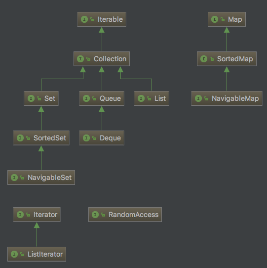

#  java集合框架

## 1、集合接口

> 集合有两个基本接口: Collection, Map。

### 1.1 Collection 子接口

*  List是一个有序集合。元素会增加到容器的指定位置。可以采用 __两种__ 方式访问元素：a,使用迭代器访问
b,使用整数索引访问(random access)
*  ListIterator 接口是Iterator的一个子接口，它提供一个方法用于在迭代器前添加一个元素。
*  Set等同于Collection接口。不过其方法又更加严谨的定义。Set中不允许添加重复元素。要适当的 __定义Set的equals方法__ ：只要两个Set具有相同的元素就认为两个Set是相等的，而不要求元素的顺序； __hashCode__ 方法的定义要保证包含相同元素的两个集合会得到相同的散列值。

### 1.2 Map 子接口

## 2、具体的集合
## 3、映射
## 4、具体的映射
## 5

参考:
* [java 核心技术（第10版）]()
* [java8 编程官方参考教程（第9版）]()